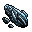
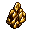
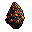
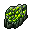

# Resources

This documents holds the foundational resources that can be collected from asteroids. It may be useful to make asteroids have a chance to spawn multiple types of things, or it could be you need several different types of asteroids.

## Crafting

### Common

- **Cobalt**

  - Akin to iron, this is the most common metal.
  - Used in various industrial processes, cobalt could be valuable for crafting specialized machinery and tools.

- **Silicon**

  - Essential for electronics manufacturing, silicon could be used in crafting advanced computer systems, sensors, and communication devices.
  - Also useful for making glass.

- **Copper**

  - Essential for electrical conductivity, copper could be used in crafting wiring, circuits, and other electrical components.

### Uncommon

- **Titanium**

  - A strong, lightweight metal often used for spacecraft construction and advanced equipment.

- **Lanthanum**

  - Optical lenses and lasers.

### Rare

- **Platinum**

  - Spacecraft components and high-tech equipment.

- **Gold**

  - Another precious metal with applications in electronics, catalytic converters, and hydrogen storage, among others.

- **Beryllium**

  - A lightweight but strong metal used in aerospace applications and in various high-tech industries.

## Energy

### Common

- **Carbon**

  - The most basic fuel source.

- **Lithium**

  - A crucial component in batteries for storing energy.

- **Hydrocarbons**

  - Used for making oil based compounds.

### Uncommon

- **Organic Matter**

  - Made into soil, fungus, plants, etc.

- **Neodymium**

  - Magnets, motors, ion thrusters.

### Rare

- **Uranium**

  - A valuable radioactive element used as fuel for nuclear reactors, providing powerful energy sources for advanced technology.

- **Plutonium**

  - A valuable radioactive element used as fuel for nuclear reactions.

## Survival

#### Common

- **Solid Hydrogen**

  - Can be used as gas, fuel, or water.

- **Solid Oxygen**

  - Can be used as gas, fuel, or water.

- **Alien Meat**

  - A gift from the enemy, food for the soul.
  - Alien heart, loin, and crawlers.
